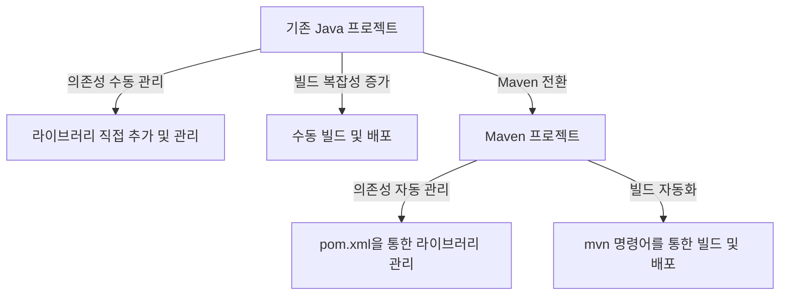

# Maven

## 1. 의존성(Dependency)

의존성이란 프로젝트가 특정 기능을 제공하는 외부 라이브러리나 프레임워크에 의존하는 것을 의미합니다.

예를 들어 웹 애플리케이션에서 JSON 데이터를 다루기 위해 Jackson과 같은 JSON 처리 라이브러리를 외부 의존성으로 추가할 수 있습니다. 이는 프로젝트의 복잡성을 줄이고 코드 재사용성을 높이기 위해 매우 중요합니다.

---

## 2. Maven을 활용한 의존성 관리

Maven은 자바 프로젝트에서 빌드 및 의존성 관리를 자동화하는 빌드 도구입니다.

`pom.xml`이라는 설정 파일을 통해 프로젝트에 필요한 라이브러리를 선언적으로 관리할 수 있습니다.

공식 문서: https://maven.apache.org/

---

## 3. IntelliJ에서 Maven 프로젝트 생성 및 설정

다음 단계로 진행합니다.

1. IntelliJ IDEA 실행 후,
    
    `File → New → Project` 를 선택합니다.
    
2. 좌측 메뉴에서 `Maven`을 선택하고, Java SDK는 `Java 17`을 설정합니다.
3. 프로젝트 이름과 저장 경로를 입력하고 프로젝트를 생성합니다.

---

## 4. Maven 프로젝트로 전환

기존 Java 프로젝트를 Maven 프로젝트로 전환하면 다음과 같은 이점이 있습니다.

- 의존성(라이브러리) 관리 자동화
- 빌드 및 배포 프로세스 표준화
- 다른 개발 환경과의 호환성 강화

### 프로젝트 전환 전후 비교



---

## 5. 기존 Java 프로젝트를 Maven 프로젝트로 전환하기

다음은 IntelliJ IDEA에서 기존 Java 프로젝트를 Maven 프로젝트로 전환하는 과정입니다.

### (1) 프로젝트 구조 확인

- 기존 프로젝트 폴더 구조:

```
MyProject
├── src
│   └── main
│       └── java
│           └── 패키지 및 소스파일들
└── lib
    └── 외부 라이브러리(.jar 파일 등)

```

### (2) Maven 프로젝트 구조로 변경

Maven은 표준 프로젝트 구조를 따릅니다. 따라서 아래와 같이 폴더 구조를 변경합니다.

```
MyProject
├── src
│   └── main
│       └── java (소스 코드)
│       └── resources (설정 및 리소스 파일)
└── pom.xml
```

- `lib` 폴더는 필요하지 않으므로 제거 가능(의존성은 pom.xml로 관리)

### (3) pom.xml 파일 생성

https://mvnrepository.com/repos/central

프로젝트 최상위 디렉터리에 `pom.xml`을 생성하고 다음과 같이 작성합니다.

```xml
<project xmlns="http://maven.apache.org/POM/4.0.0"
         xmlns:xsi="http://www.w3.org/2001/XMLSchema-instance"
         xsi:schemaLocation="http://maven.apache.org/POM/4.0.0
                             https://maven.apache.org/xsd/maven-4.0.0.xsd">
    <modelVersion>4.0.0</modelVersion>

    <groupId>org.example</groupId>
    <artifactId>myproject</artifactId>
    <version>1.0-SNAPSHOT</version>

    <properties>
        <maven.compiler.source>17</maven.compiler.source>
        <maven.compiler.target>17</maven.compiler.target>
    </properties>

    <dependencies>
        <!-- Jackson Databind 의존성 추가 -->
        <dependency>
            <groupId>com.fasterxml.jackson.core</groupId>
            <artifactId>jackson-databind</artifactId>
            <version>2.17.0</version>
        </dependency>
    </dependencies>
</project>
```

---

## 6. Jackson을 사용한 JSON 처리 예제

Java 객체를 JSON으로 변환하거나, JSON 문자열을 Java 객체로 변환하는 예제입니다.

### (1) User 클래스 작성

```java
public class User {
    private String name;
    private int age;

    public User() {}

    public User(String name, int age) {
        this.name = name;
        this.age = age;
    }

    public String getName() { return name; }
    public void setName(String name) { this.name = name; }
    public int getAge() { return age; }
    public void setAge(int age) { this.age = age; }
}

```

### (2) Java 객체 → JSON 변환 (직렬화)

```java
import com.fasterxml.jackson.databind.ObjectMapper;

public class JacksonSerialization {
    public static void main(String[] args) {
        User user = new User("Lee", 28);

        ObjectMapper mapper = new ObjectMapper();
        try {
            String json = mapper.writeValueAsString(user);
            System.out.println("JSON 결과: " + json);
        } catch (Exception e) {
            e.printStackTrace();
        }
    }
}
```

### (3) JSON → Java 객체 변환 (역직렬화)

```java
import com.fasterxml.jackson.databind.ObjectMapper;

public class JacksonDeserialization {
    public static void main(String[] args) {
        String json = "{\"name\":\"Lee\",\"age\":28}";

        ObjectMapper mapper = new ObjectMapper();
        try {
            User user = mapper.readValue(json, User.class);
            System.out.println("객체 결과: name=" + user.getName() + ", age=" + user.getAge());
        } catch (Exception e) {
            e.printStackTrace();
        }
    }
}
```

### JSON 변환 흐름
```
graph LR
A[Java 객체: User] -->|직렬화| B[JSON 문자열]
B -->|역직렬화| A
```